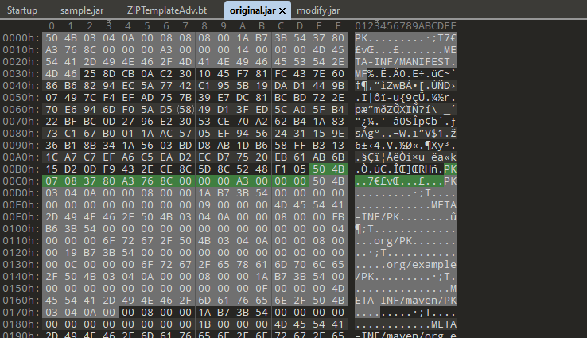
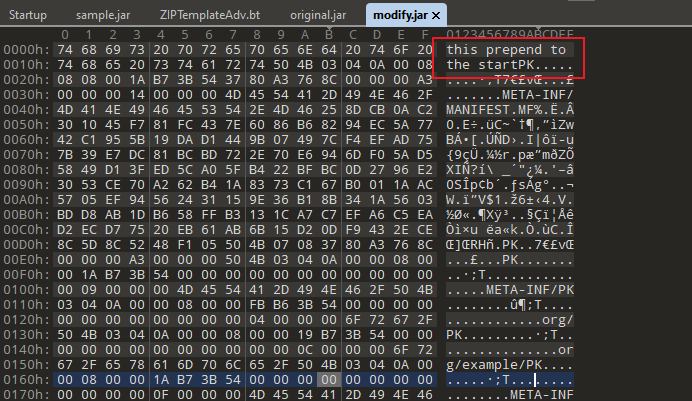
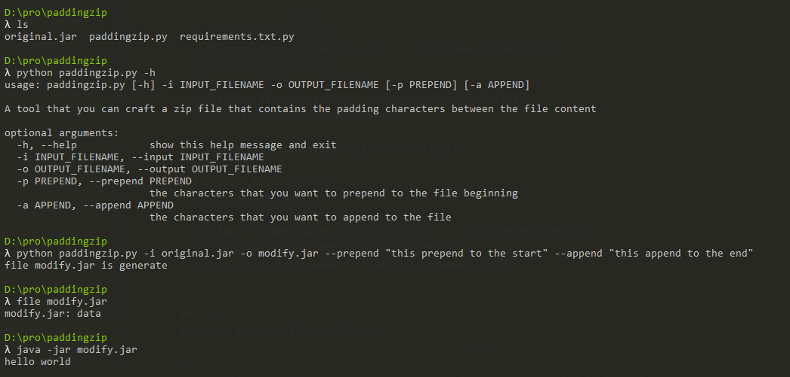

# PaddingZip 

PaddingZip is a tool that you can craft a zip file that contains the padding characters between the file content.

A normal zip file:



A craft but valid zip file:



For example, you can craft a valid JAR file using PaddingZip:



## Usage

```shell
$ python paddingzip.py -h
usage: paddingzip.py [-h] -i INPUT_FILENAME -o OUTPUT_FILENAME [-p PREPEND] [-a APPEND]

A tool that you can craft a zip file that contains the padding characters between the file content

optional arguments:
  -h, --help            show this help message and exit
  -i INPUT_FILENAME, --input INPUT_FILENAME
  -o OUTPUT_FILENAME, --output OUTPUT_FILENAME
  -p PREPEND, --prepend PREPEND
                        the characters that you want to prepend to the file beginning
  -a APPEND, --append APPEND
                        the characters that you want to append to the file

```

For example:

```shell
python paddingzip.py -i original.jar -o modify.jar --prepend "this prepend to the start" --append "this append to the end"
```

## `zip -F`

You also can use `zip -F` to fix the offset:

```shell
$ echo -n "prepend" > f
$ cat f a.zip > b.zip
$ zip -F b.zip --out c.zip
```

## License

MIT License
